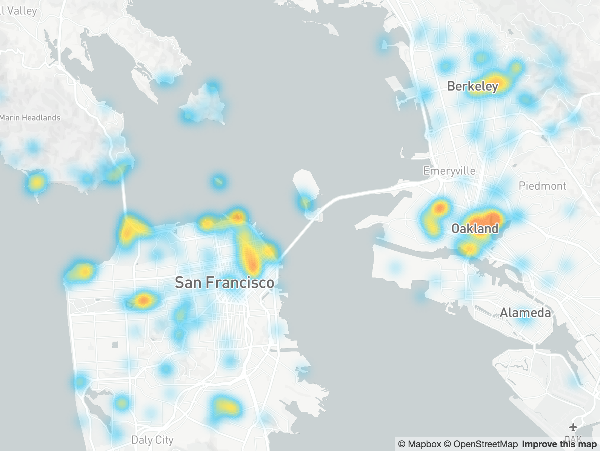

## Hexgrid-based vector heatmaps for your Mapbox GL JS Maps




### Usage
See the [examples directory](examples/index.html) for an example of usage. You will need to provide your own Mabox access token to view the map.

Here's how it works:

- Create an instance of `HexgridHeatmap`. It will automatically add the necessary layer and events to the specified map:
  ```
var heatmap = new HexgridHeatmap(map, "hexgrid-heatmap", "waterway-label");
```

- You can control the intensity and spread of the points:
  ```
heatmap.setIntensity(15);
heatmap.setSpread(0.3);
```

- Feed in a GeoJSON `FeatureCollection` full of points to map
  ```
heatmap.setData(sightseeingPOIs);
```

- Manually call `update()` after changing settings. The heatmap will automatically call update() when moving and zooming the map.
  ```
heatmap.update();
```

- You can set your own color palette using stops conforming to the Mapbox GL style spec:
  ```
heatmap.setColorStops([
    [0, "rgba(0,185,243,0)"],
    [50, "rgba(0,185,243,0.5)"],
    [130, "rgba(255,223,0,0.6)"],
    [200, "rgba(255,105,0,0.6)"]
]);
```
